# 2023年数算"星际消战Eraser"大作业开发文档
## 一 游戏背景及参赛要求

数据结构与算法课创意大作业随着五月一起到来啦！今年的大作业项目灵感来源于经典小游戏“消消乐”，是基于之改编的棋盘对战游戏，鼓励双方在“同色相消”的过程中布局、决策，展现策略，形成博弈。

在游戏中，参赛双方（A、B）在同一比赛场地内通过交换相邻棋子，使同色棋子出现同一方向上（水平或垂直）三个及以上数量的相连，根据消除的情况获得相应分数。每局对决以分数累计评定胜负。

A、B双方每场比赛分为20局，每两局使用**同一组**棋盘数据，在该棋盘上，A、B双方各作为先手、后手对局一次。每局结束进行分数结算，胜者队伍胜局数加一。每次对决20局结束后，胜局多者获胜。每次对决，最终结果为A获胜、B获胜，或平局。

***
## 二 游戏规则与运行机制
### 2.1 棋子描述与棋盘结构
每个回合双方面对同个二维棋盘，每个棋盘有6列，1200行。每个格子摆放一个棋子，棋子分为五色。最下方的6行组成的 $6\times 6$ 棋盘为主棋盘，棋盘其余部分为储备棋盘。如下图所示:

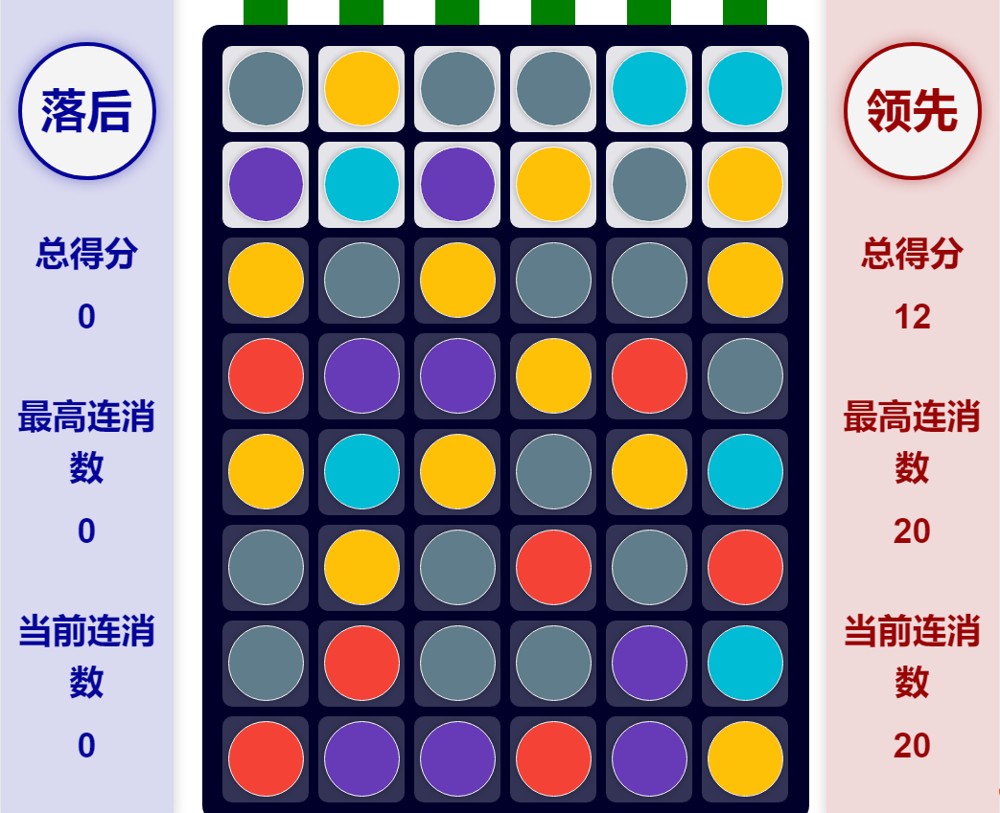

（图中显示了主棋盘与部分储备棋盘）

每次决策前，玩家将获知当前整个棋盘（包含主棋盘与储备棋盘）的棋子分布情况。但是只有主棋盘可进行操作，上层储备棋盘不能进行操作。
### 2.2 信息供给与玩家操作
每个回合决策前，玩家将获知如下信息：
- 当前所有棋盘的棋子分布情况；
- 当前主棋盘上所有**可导致消除**的交换操作；
- 当前双方分数；
- 当前回合数；
- 本局游戏到目前为止敌我双方所进行的全部操作（按操作发生的顺序）；
- 双方已使用时间。

然后，玩家可以进行一次主棋盘上**任意相邻棋子**的交换操作:
- 或使得移动后同一方向上（水平或垂直）存在三个及以上同色棋子，消除同色连通区域；
- 或不进行消除，仅进行一步布局。

### 2.3 消除过程与单回合分数计算
棋子有效同色连通区域可以发生消除。有效同色连通区域即，主棋盘上同色棋子相连形成的区域，要求同一方向上（水平或垂直）存在三个及以上同色棋子。下图显示了主棋盘上的棋子可进行消除的情况，即棋子有效同色连通区域的可能形状。  

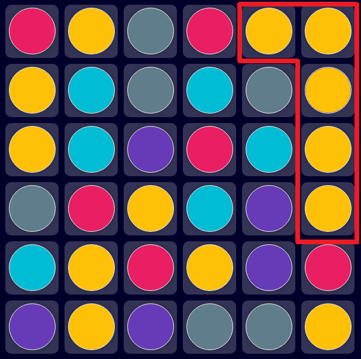 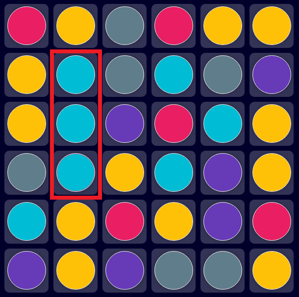

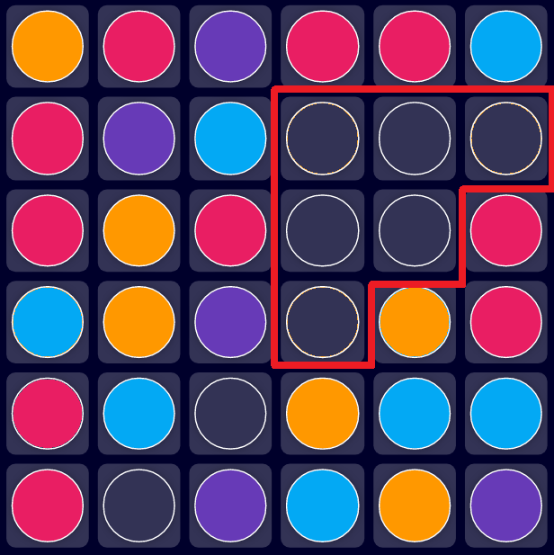 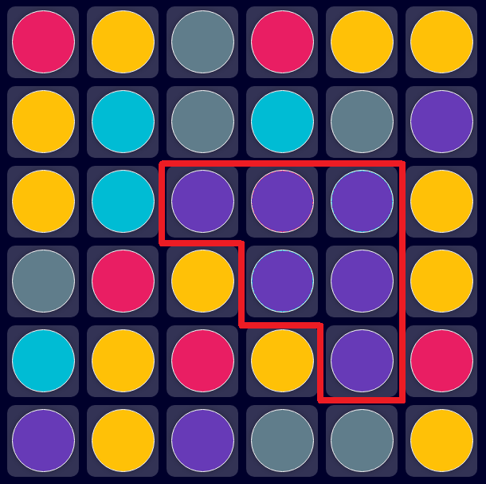

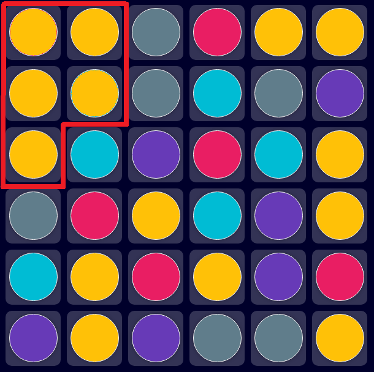 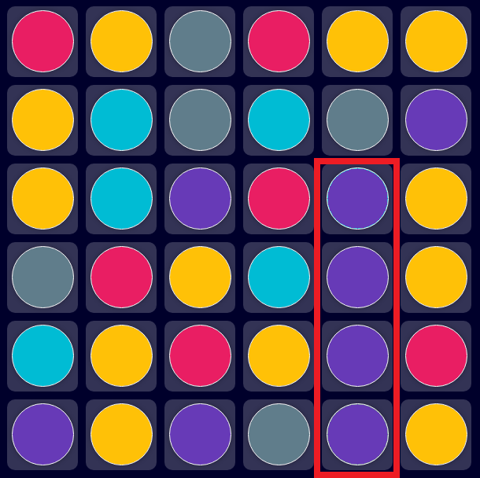

上面的实例展示了部分具有代表性的有效同色连通区域情况，下面将展示一些非有效同色连通区域的例子：

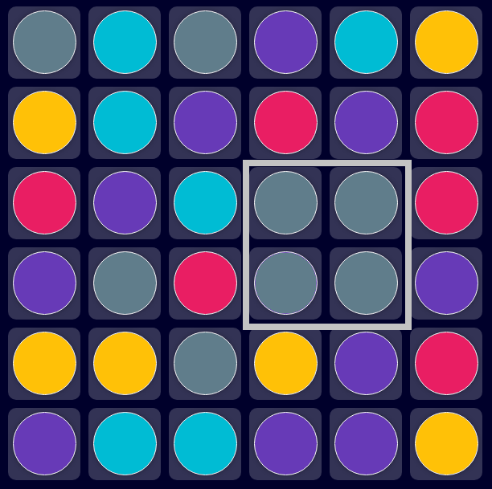  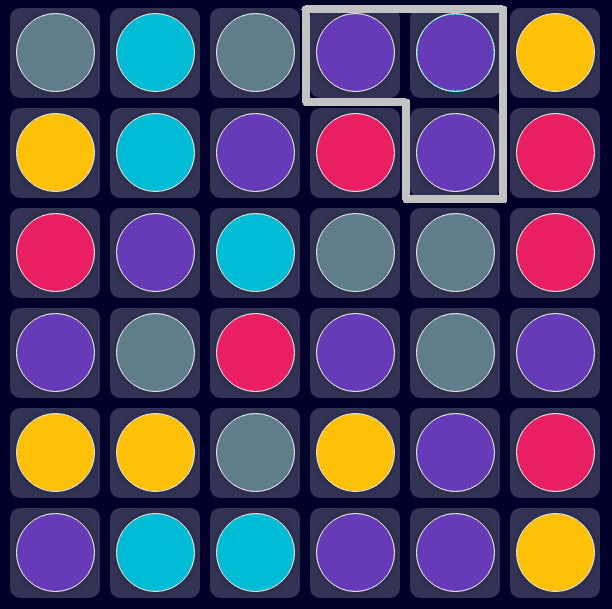  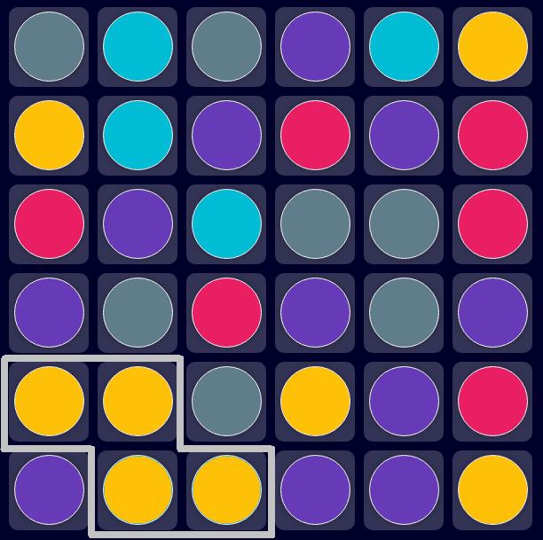

这些非有效同色连通区域的共性是，虽然有三个及以上多个同色棋子相连，但是**在同一个方向上**不存在至少三个棋子相连。

假定本回合玩家A下棋，若其操作导致有效同色连通区域出现，则按顺序进入计分-移除-掉落三个步骤的循环，直到主棋盘上不存在三个以上同色相连的棋子，即有效同色连通区域：

- 计分：假定此时棋盘上存在 $n$ 个有效同色连通区域（若不存在有效同色连通区域，则退出循环），每块有效同色连通区域由 $m$ 个同色棋子组成，则该有效同色连通区域得分为 $(m-2)^2$，当前主棋盘累计得分为 $n$ 块有效同色连通区域的得分数累加，即

$$
\text{Scores} = \sum_{i=1}^n (m_i - 2)^2
$$

- 移除：结算毕当前棋盘所有有效同色连通区域的分数后，所有有效同色连通区域上的全部棋子同时被移除。

- 掉落：此时，棋盘空缺的位置由储备棋盘相应列的棋子掉落补充。

循环结束后，玩家A的下棋回合结束，轮到玩家B进行操作。

下图展示了一个循环实例：
- 计分

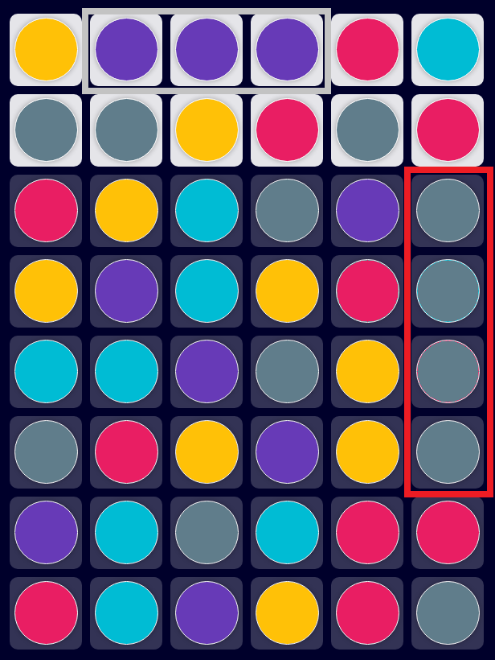

红色框勾出了主棋盘所有可以进行消除的有效同色连通区域，请注意，灰色框勾出的连通区域属于储备棋盘，不发生消除。有效同色连通区域（1个）共包含4个棋子，得分为 $(4-2)^2=4$ 分。结算毕。

- 移除

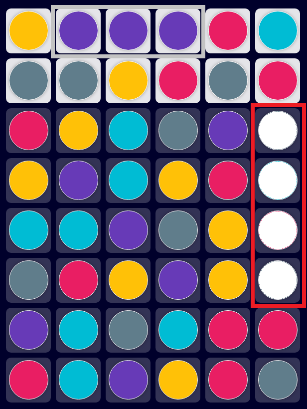

移除棋子。

- 掉落

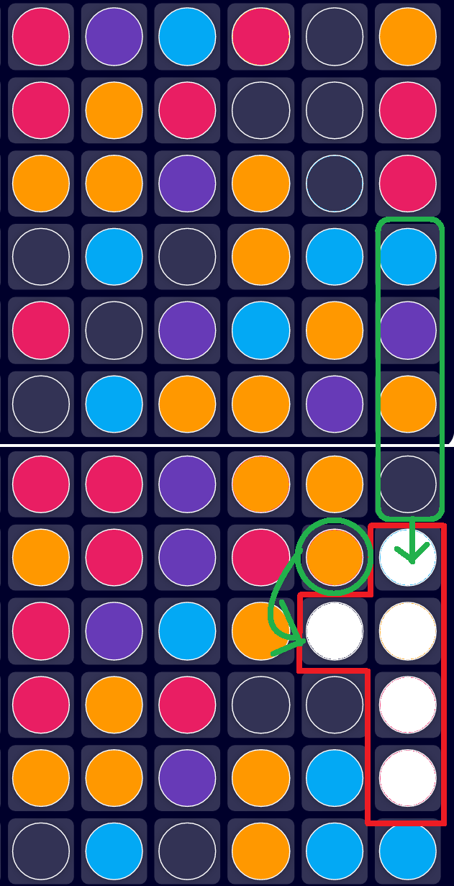   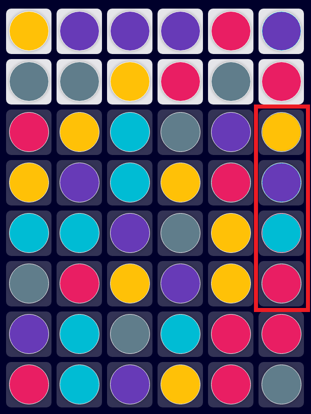

棋子顺**列**重力下落。
- 计分
新的主棋盘分布没有有效同色连通区域存在，退出循环，回合结束。

### 2.4 对局结束情况

#### (1) 普通结束情况
普通结束情况在对局结束后进行分数结算，分数高者获胜。如分数持平，则所消耗时间少者获胜。
#### a 棋盘空缺
若某次操作计分——某位置棋子消除后，储备棋盘相应列已经没有足够棋子进行补充（即此时主棋盘出现棋子空缺），则对局提前结束，直接进行结算。
#### b 总操作数达到上限
若对局总操作数达到上限200次（双方各操作100次），对局结束，进行结算。
#### c 当前局面不存在可消除操作
如果当前局面不存在可消除操作，则结束对局，进行分数结算。

#### (2)直接判负情况

#### a 决策超时
游戏正常结束前，若己方调用`move`函数累计总用时超过1min，则判负。

#### b 出现报错
若出现程序报错，直接判负。

#### c 出现非法操作
若出现非法操作（包括但不限于）：
- 玩家返回数据结构不符合[四中的要求](#四-玩家提交文件要求)；
- 选择交换的棋子不相邻，或其中某个棋子不在主棋盘内；则直接判负。

### 2.5 初始棋盘声明
提供的所有初始棋盘都是随机生成的，但保证同个方向上（水平或垂直）最多只有两个同色棋子相连，即初始没有进行可消除的有效同色连通区域。

***

## 三 传入数据结构及玩家须知属性
每回合系统调用`move`函数时传入数据为包含四个参数，依次为：
- 当前棋盘 `board`（一个存储字符串的二维列表）：`board[x][y]` 表示自左向右第 `x` 列，自下向上第 `y` 行的棋子颜色，例如 `"R"`, `"G"` 等，若当前格子 `board[x][y]` 不存在棋子，则 `board[x][y]=="nan"`。
- 可导致消除的操作列表 `operations`（一个二维列表）: `operations[i]` 是一个形如 `((x1, y1), (x2, y2))` 的元组，表示一对交换后可以导致消除的相邻棋子。`(x1, y1)` 表示坐标为 $(x_1, y_1)$ 的棋子。
- 双方分数 `scores` (列表)，`scores[0]` 为本队分数，`scores[1]` 为对手分数。
- 当前回合数 `turn_number` （整数）：指属于己方的1-100操作回合。  

游戏平台将给`Plaser`添加两个属性`move_history`和`used_time`:
- `move_history`:一个列表：包含敌我双方的操作，按操作发生的时间顺序排列。此列表在每回合操作发生后进行更新，新的操作被加入到列表末端，玩家可以根据需要查询操作记录。（`self.move_history[i]` 是一个形如 `((x1, y1), (x2, y2))` 的元组：(x1, y1), (x2, y2)表示一次交换相邻棋子的操作。）
- `used_time`:一个列表，`self.used_time[0]`表示己方已经使用的时间长短，`self.used_time[1]`表示对方已经使用的时间长短，这两个浮点数在每回合操作完成后进行更新。
***
## 四 玩家提交文件要求
玩家需要编写并提交一个python文件，其中应包含 `Plaser` 类（Plaser=Player+Eraser）。 `Plaser` 类中至少要实现成员方法 `move(self, board, operations, scores, turn_number)` 与初始化方法 `__init__(self,is_First)` 。  

> 注意：每**局**游戏开始时，服务器将创建一个`Plaser`实例，同时传入`is_Fisrt`参数表示该局己方是先手或是后手，先手用`True`表示，后手用`False`表示。

`move`方法应返回一个长度为2的元组，包含决定交换的两个棋子坐标（用元组表示），形如`((x1, y1), (x2, y2))`。注意，两个棋子应该相邻且位于主棋盘内。坐标定义方法与传入数据中的一致。

> 注意：python文件可以使用的库有：`math`，`copy`，`collections`，`random`，`numpy`，`time`，`itertools`，`functools`，其余库均不允许使用。另外，请避免使用`eval()`函数，否则代码上传将不成功。

***
## 五 关于测试与调试
下文所述工具与文件请自行前往github下载：[星际消战](https://github.com/XueFengBoyanLiu/pkudsa.eraser)。

### 5.1 关于统一公布的AI
技术组提供了若干个公开的、较为基础的AI文件，供各小组强化自己的算法。其中包括随机决策AI，和使用贪心策略的AI。各小组可以利用这些AI，根据自身情况逐步调试、开发自己的算法。目前在线上代码竞技场中稳定运行的AI有：
- random robot：若可导致消除的操作列表`operations`长度大于0，则从列表中进行随机选择一个操作执行；若长度为0则随机交换主棋盘上的棋子。
- greedy robot：选择操作后使单回合得分最多的操作，单回合得分计算方法参见[二](#二-游戏规则与运行机制)。

### 5.2 本地调试工具：
将要进行测试的两个.py文件重命名为`player1.py`和`player2.py`, 并把它们放入`local_debugger.py`所属的目录。运行`local_debugger.py`，得到两个用于复盘的`json`文件，即`replay1.json`和`replay2.json`，其中`replay1.json`记录`player1`先手的对局。

> 注意：运行时应确保`board.py`, `interaction.py`, `eraserconfig.py`, `exception_manager.py`在当前目录下。

### 5.3 复盘数据可视化工具：
- 将`main.html`在（主流）浏览器中打开，在页面右上角点击橙色按钮，从电脑中选择一个复盘记录（`.json`）打开，在页面中观看比赛过程复盘。导入复盘记录后，可在页面右上角使用播放工具调整复盘进程。
- 左上角黑色按钮可切换得分图中显示分差/总得分。
- 主棋盘上方绿色的传送条长度表示该列对应储备棋盘的剩余棋子数。
- 刷新网页即可进行下一次复盘。

更多功能参见：
[功能演示视频](https://www.bilibili.com/video/BV12o4y1c7Sn/?vd_source=ece9f8be48529369c064ce2d9003d536)。

另外，服务器对战平台也可点击相应对局直接进行可视化。

## 六 模拟赛和正式赛
### 6.1 模拟赛
模拟赛从即日起开始到6月2日结束。所有同学都可以注册个人用户，上传自己的文件至代码竞技场自由对战，厮杀。代码竞技场的网页链接：[星际消战代码竞技场](http://gis4g.pku.edu.cn/ai_arena/game/7/) 。模拟赛天梯分不计入大作业成绩。

### 6.2 正式赛
各小组以小组账号登录，上传正式参赛代码文件（限一份）。暂定于6月1日 18:00 发放小组账号，上传时间期限为6月2日 18:00 。注意提交后小组的参赛代码文件不可修改。
分为天梯赛和淘汰赛两个环节：
- 6月3日（周六）-6月5日（周一）为天梯赛，代码竞技场选取天梯前八名出线，进入淘汰赛决赛。
- 6月6日（周二）在课堂进行淘汰赛决赛，决出冠亚季军，发放奖品，纪念品等。  

祝各小组大作业顺利~

***
