# Eraser-星际消战
***
## 引言
此文档是“Eraser-星际消战”的规则文档
## 总述
星际消战是基于“消消乐”改编的棋盘对战游戏，鼓励双方在“同色相消”的过程中展现策略，形成博弈。 

参赛双方（A、B）在同一比赛场地内通过交换相邻棋子，使同色棋子出现同一方向上（水平或垂直）三个及以上数量的相连，根据消除的情况获得相应分数，每局对决以分数累计评定胜负。  

A、B双方每场比赛分为20局，每两局使用同一组棋盘数据，A、B双方各作为先手、后手对局一次。每局结束进行分数结算，胜者胜局数加一。20局结束后，胜局多者获胜。最终结果为A获胜、B获胜，或平局。  

***
## 规则主体
### （一）棋子描述与棋盘结构
每个回合双方面对同**组**棋盘，每组棋盘共n**层**，各层棋盘的**列**相互对齐，在竖直面上顺序排列。每**层**棋盘由8*8个格子组成，每个格子摆放一个棋子，棋子分为四色。如下图所示:  

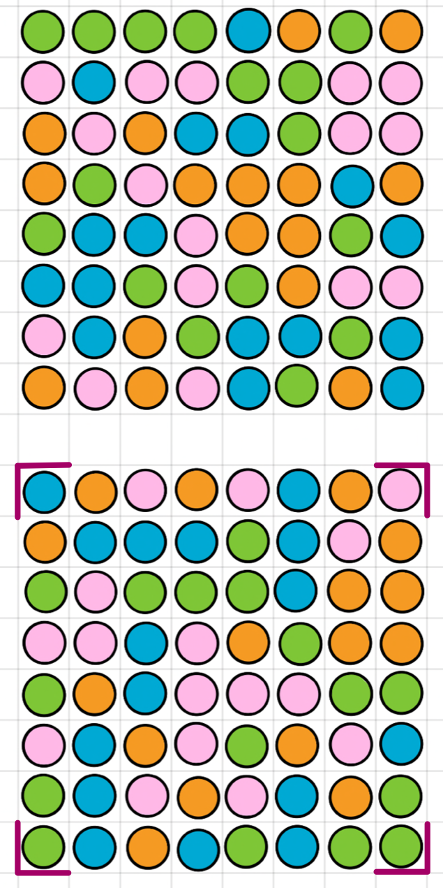  

（图中显示了底层主棋盘与**第一层**储备棋盘）

最底层棋盘为主棋盘，其余棋盘为储备棋盘。每次决策前，玩家将获知当前所有棋盘（主棋盘与储备棋盘）的棋子分布情况。只有最底层主棋盘可进行操作，上层储备棋盘不能进行操作。
### （二）信息供给与玩家操作
每个回合决策前，玩家将获知如下信息：  
- 当前所有棋盘的棋子分布情况。 
- 当前主棋盘上所有**可导致消除**的交换操作。
  
然后，玩家可以进行一次**任意相邻棋子**的交换操作，操作分为两种情况：
- 或使得移动后同一方向上（水平或垂直）存在三个及以上同色棋子，消除同色连通区域；
- 或不进行相连消除，仅作为一步布局。

### （三）消除过程与单回合分数计算
可消除情况即主棋盘同一方向上（水平或垂直）存在三个及以上同色棋子，下图显示了主棋盘上的棋子可进行消除的情况，即棋子有效连通区域的可能形状。  
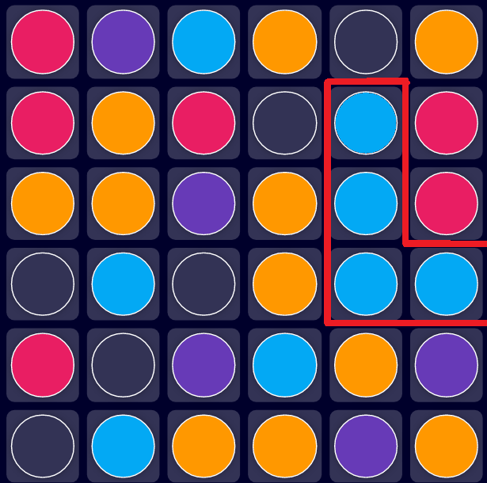  

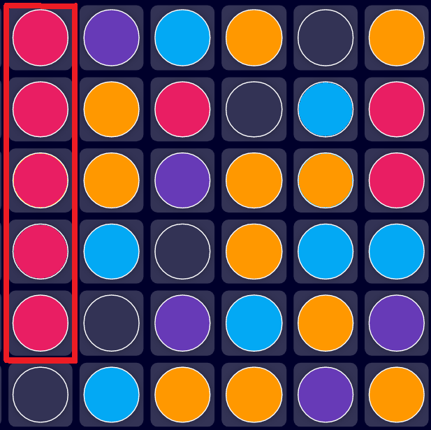  

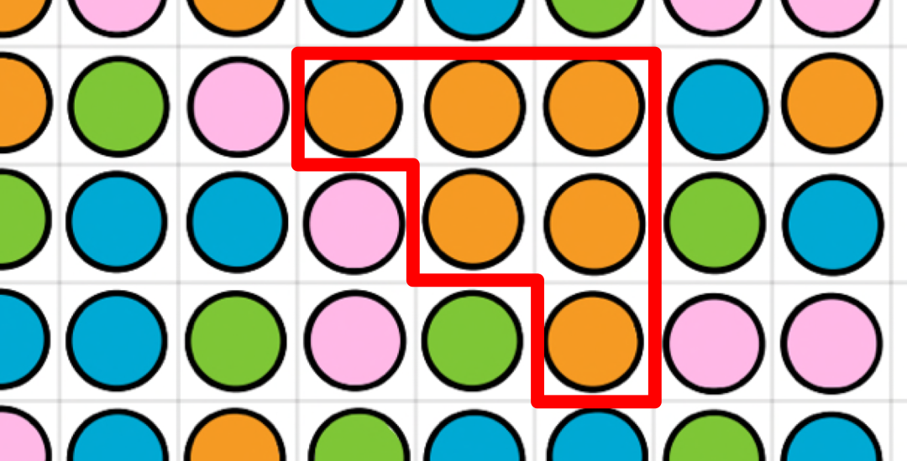  

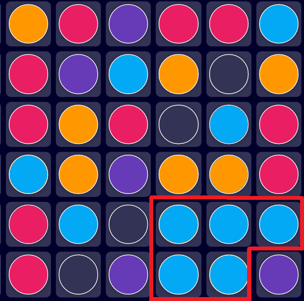  

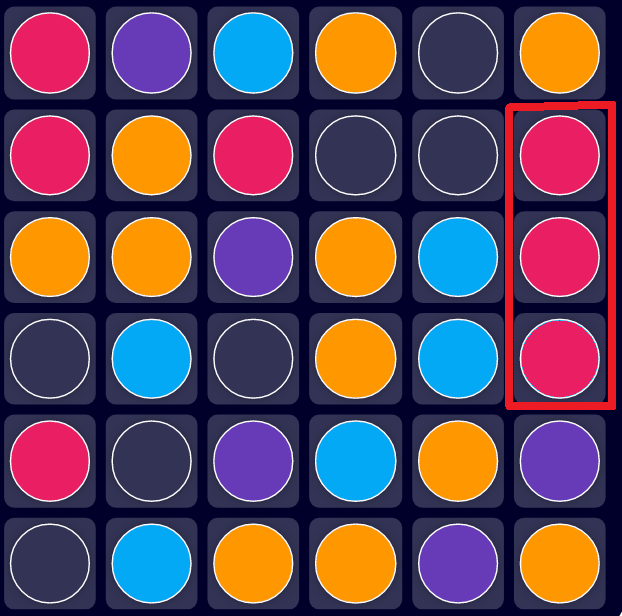  

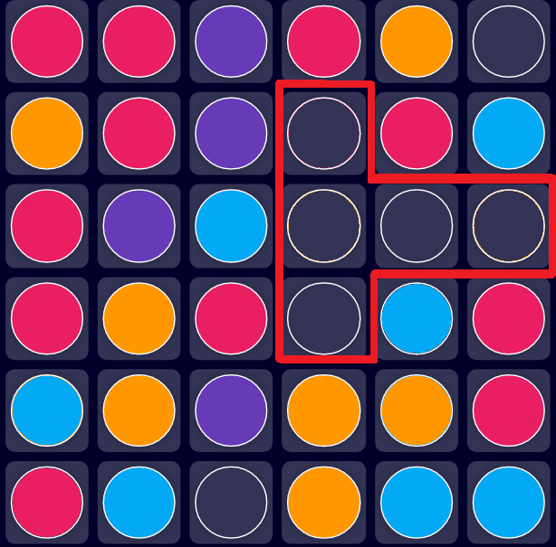   

上面的实例展示了部分具有代表性的有效连通区域情况，下面将展示一些非有效连通区域的例子：  

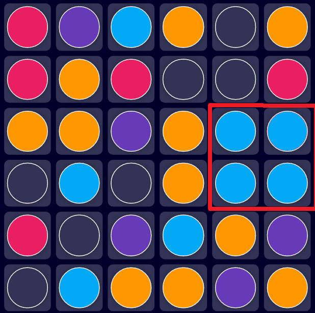  

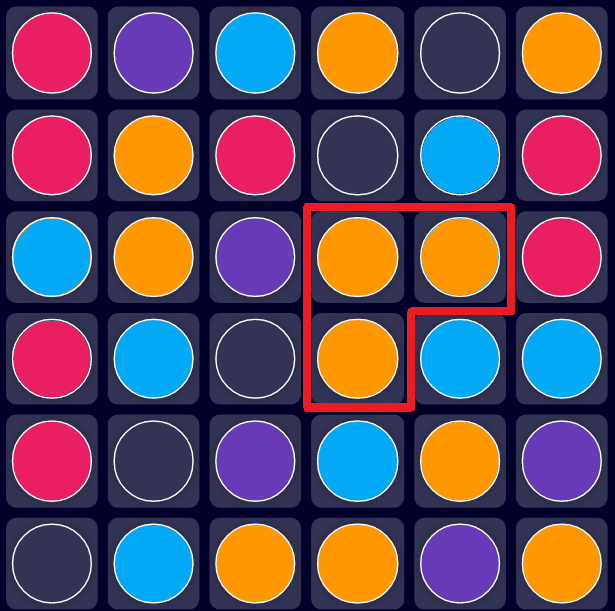  

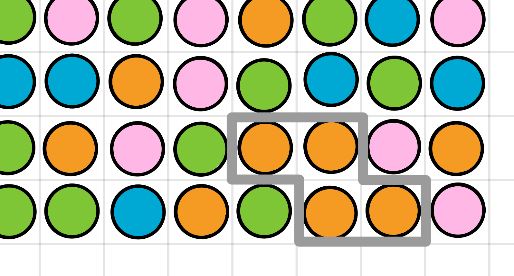  

这些非有效连通区域的共性是，虽然有三个及以上同色棋子相连，但是**在同一个方向上**不存在至少三个棋子相连。

假定本回合玩家A下棋，若其操作导致上述情况之一出现，则按顺序进入计分-移除-掉落三个步骤的循环，直到主棋盘上不存在三个以上同色相连的棋子，即有效连通区域：

- 计分：假定此时棋盘上存在n个有效连通区域（若不存在有效连通区域，则退出循环），每块有效连通区域由m个同色棋子组成，则该有效连通区域得分为（m-2)^2，当前主棋盘累计得分为n块有效连通区域的得分数累加。
- 移除：结算毕当前棋盘所有有效连通区域的分数后，有效连通区域上的所有棋子同时被移除。
- 掉落：此时，棋盘空缺的位置由最下面一层的储备棋盘相应位置的棋子掉落补充。储备棋盘上空缺的位置由倒数第二层储备棋盘掉落棋子补充，依此类推，直到无法进行重力掉落补充情况（上一层储备棋盘相应位置没有棋子）。

循环结束后，玩家A的下棋回合结束，轮到玩家B进行操作。  

下图展示了一个循环实例：  
- 计分  

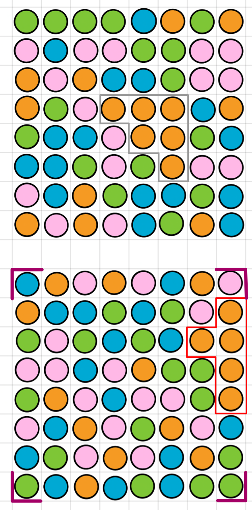  
红色框勾出了主棋盘所有可以进行消除的有效连通区域，请注意，灰色框勾出的连通区域属于储备棋盘，不发生消除。有效连通区域共包含5个棋子，得分为（5-2）^2=9分。结算毕。 
- 移除  

  
移除棋子。  
- 掉落  

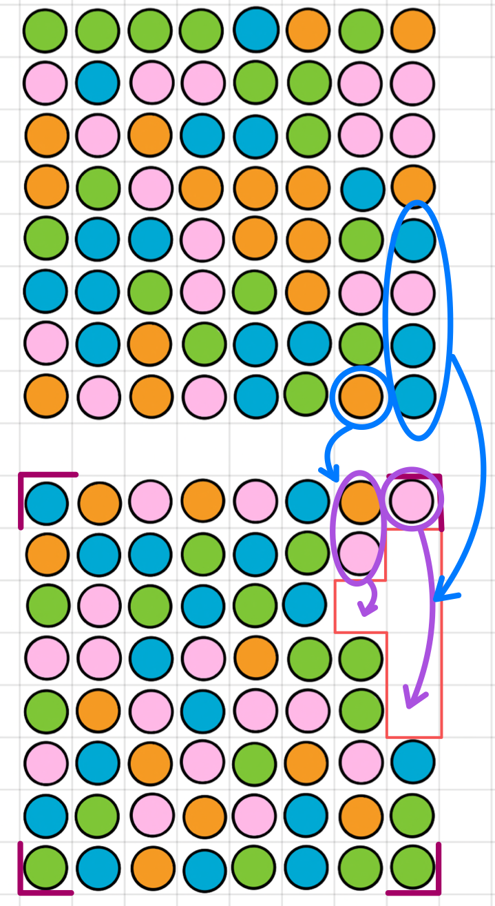  

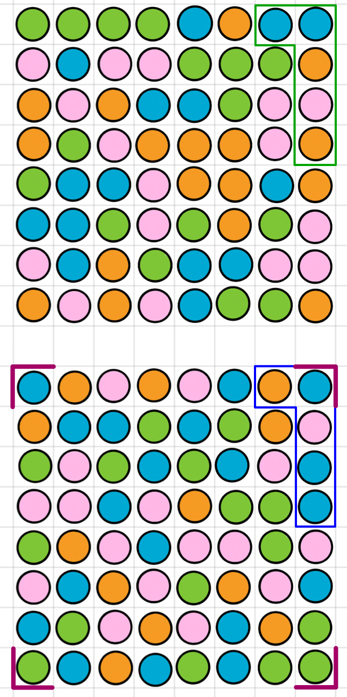  
棋子顺**列**重力下落，图中蓝色框勾出的区域是第一层储备棋盘对主棋盘的棋子补充，绿色框勾出的区域是第二层储备棋盘对第一层主棋盘的棋子补充，以此类推。 
- 计分  
新的主棋盘分布没有有效连通区域，退出循环，回合结束。  

### （四）对局结束情况
#### 1、棋盘空缺
若某次操作计分后，某位置棋子消除后，上层储备棋盘相应列已经没有足够棋子进行补充（即此时棋盘出现棋子空缺），则对局提前结束，直接进行结算。
#### 2、回合数达到上限
若对局回合数达到1000，对局结束，进行结算。
#### 3、决策超时
从获得棋盘信息与操作列表开始，直到玩家返回操作，限时100ms，若超时直接判负。

#### 4、出现报错
若出现程序报错，直接判负。

#### 5、出现非法操作
若出现非法操作，直接判负。

### （五）初始棋盘声明
提供的所有初始棋盘保证最多只有两个同色棋子相连，即初始没有可消除的棋子。

***
